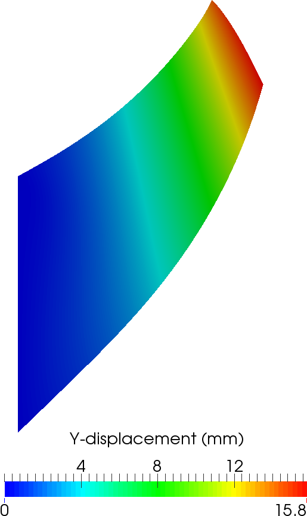

## Overview
The Cook membrane (or cantilever) problem is a classic benchmark test for
finite element formulations for solid mechanics. It is typically used to
test for and demonstrate the shear-locking (or locking-free) behaviour of
a finite element ansatz under quasi-incompressible conditions.
As it is so widely referred to in the literature on finite-strain elasticity,
we reproduce the example here.
However, we consider on the compressible case to avoid many of the complexities
that arise in `step-44`, which provides an efficient approach to deal with
the quasi-incompressible case.

### A classical approach to solving the cook membrane problem.

In this work we take a classical approach to solving the equations governing
quasi-static finite-strain compressible elasticity, with code based on
`step-44`. The formulation adopted here is that seen in many texts on solid
mechanics and can be used as the starting point for extension into many
topics such as material anisotropy, rate dependence or plasticity, or even as
a component of multi-physics problems.

The basic problem configuration is summarised in the following image.
A beam of specific dimensions is fixed at one end and a uniform traction load
is applied at the other end such that the total force acting on this surface
totals 1 Newton. Displacement in the third coordinate direction (out of plane)
is prevented in order to impose plane strain conditions.


Note that we perform a three-dimensional computation as, for this particular
formulation, the two-dimensional case corresponds to neither plane-strain
nor plane-stress conditions.


## Requirements
* Version 8.2.1 or greater of `deal.II`


## Compiling and running
Similar to the example programs, run
```
cmake -DDEAL_II_DIR=/path/to/deal.II .
```
in this directory to configure the problem.  
You can switch between debug and release mode by calling either
```
make debug
```
or
```
make release
```
The problem may then be run with
```
make run
```


## Reference for this work
If you use this program as a basis for your own work, please consider citing it in your list of references.
The initial version of this work was contributed to the deal.II project by the authors listed in the following citation:
* J-P. V. Pelteret and A. McBride, The deal.II code gallery: Quasi-Static Finite-Strain Compressible Elasticity, 2016. DOI: [10.5281/zenodo.437601](http://doi.org/10.5281/zenodo.437601) 

### Acknowledgements
The support of this work by the European Research Council (ERC) through the Advanced Grant 289049 MOCOPOLY is gratefully acknowledged by the first author.


## Recommended Literature
* C. Miehe (1994), Aspects of the formulation and finite element implementation of large strain isotropic elasticity International Journal for Numerical Methods in Engineering 37 , 12, 1981-2004. DOI: [10.1002/nme.1620371202](http://doi.org/10.1002/nme.1620371202);
* G.A. Holzapfel (2001), Nonlinear Solid Mechanics. A Continuum Approach for Engineering, John Wiley & Sons. ISBN: [978-0-471-82319-3](http://eu.wiley.com/WileyCDA/WileyTitle/productCd-0471823198.html);
* P. Wriggers (2008), Nonlinear finite element methods, Springer. DOI: [10.1007/978-3-540-71001-1](http://doi.org/10.1007/978-3-540-71001-1);
* T.J.R. Hughes (2000), The Finite Element Method: Linear Static and Dynamic Finite Element Analysis, Dover. ISBN: [978-0486411811](http://store.doverpublications.com/0486411818.html)

The derivation of the finite-element problem, namely the definition and
linearisation of the residual and their subsequent discretisation are quite
lengthy and involved. Thankfully, the classical approach adopted in this work is
well documented and therefore does not need to be reproduced here.
We refer the reader to, among many other possible  texts, Holzapfel (2001) and
Wriggers (2008) for a detailed description of the approach applied in this work.
It amounts to a reduction and slight reworking of `step-44` (accounting for
the removal of the two additional fields used therein). We also refer the reader
to `step-44` for a brief overview of the continuum mechanics and kinematics
related to solid mechanics.

## Results
These results were produced using the following material properties:
* Shear modulus is 422.5kPa
* Poisson ratio is 0.3

The 32x32x1 discretised reference geometry looks as follows:


And an example of the displaced solution is given in the next image.



Below we briefly document the tip displacement as predicted for different
discretisation levels and ansatz for the displacement field.
A direct and, by visual inspection, favourable comparison of the following
results can be made with those found in Miehe (1994).
Since the material is compressible, shear-locking is not exhibited by the
beam for low-order elements.

#### Number of degrees of freedom

Elements per edge |        Q1       |        Q2
:---------------: | :-------------: | :-------------:
1                 |  24             | 81
2                 |  54             | 225
4                 |  150            | 729
8                 |  486            | 2601
16                |  1734           | 9801
32                |  6534           | 38025
64                |  25350          | 149769

#### Tip y-displacement (in mm)

Elements per edge |        Q1       |        Q2
:---------------: | :-------------: | :-------------:
1                 | 5.15            | 12.19
2                 | 8.72            | 13.83
4                 | 12.02           | 14.22
8                 | 13.61           | 14.30
16                | 14.13           | 14.32
32                | 14.28           | 14.33
64                | 14.32           | 14.33
