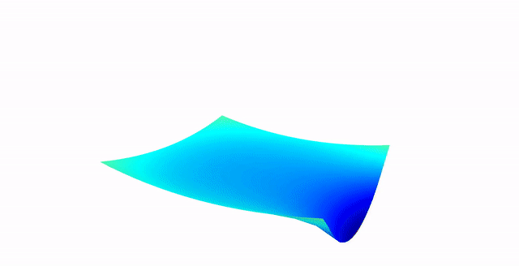

Laplace equation coupled to an external simulation program
------------------------------------------
## Overview

preCICE allows to couple deal.II to external simulation software, such as OpenFOAM, SU2, or CalculiX. To keep dependencies of this example minimal, we couple deal.II to an external C++ program, which provides a time varying boundary condition. The deal.II code consists mainly of the [`step-4` tutorial program](https://www.dealii.org/developer/doxygen/deal.II/step_4.html), where a simple Laplace problem is solved. 

Coupling with preCICE is usually carried out along surfaces in order to apply a Dirichlet-Neumann coupling between two domains (volume coupling is also possible). For the sake of simplicity, we couple the external C++ program in a unidirectional fashion to one side of our quadrilateral domain. The external C++ program generates a parabolic boundary profile with time varying amplitude. The boundary values are then used in the Laplace solver as a Dirichlet boundary condition.

## Time discretization
Coupled simulations deal mostly with time-dependent problems. Hence, we modify the stationary Laplace problem from step-4 by a time-dependent problem
@f{align*}
  \\frac{\partial u}{\partial t}-\Delta u &= f \qquad\qquad & \text{in}\ \Omega,
  \\
  u &= x^2+y^2 \qquad\qquad & \text{on}\ \partial\Omega_s,
  \\
  u &= g(t) \qquad\qquad & \text{on}\ \partial\Omega_c.
@f}

The system is consequently discretized by a first-order backward Euler method, resulting in

@f{align*}
 ((\varphi_i, \varphi_j) + \Delta t (\nabla\varphi_i, \nabla \varphi_j)) u_j^{n+1}
   = \Delta t (\varphi_j, f) + (\varphi_j,u_j^{n})
@f}


## Requirements

* Version `9.2` or greater of `deal.II`

* [preCICE](https://github.com/precice/precice/wiki#1-get-precice), version `2.0` or greater.

## Compiling and running

Similar to the example programs, run
```
cmake -DDEAL_II_DIR=/path/to/deal.II .
```
in this directory to configure the problem.
You can then switch between debug and release mode by calling either
```
make debug
```
or
```
make release
```
This command will generate two executables: one for the `coupled_laplace_problem` and one for the `fancy_boundary_condition` participant.
```
./coupled_laplace_problem
```
excutes the `coupled_laplace_problem`. In order to start the coupled simulation, execute
```
./fancy_boundary_condition
```
in the same directory from another terminal window.

## Results

By default, the results are saved in each time step using `vtk` files, which can, for example, be visualized with ParaView. You should get something like:


## Further reading

* A complete overview of the preCICE project can be found on the [preCICE webpage](https://www.precice.org/).
* The [source code](https://github.com/precice/precice/) of preCICE is hosted on Github.
* For more coupled deal.II codes, have a look at the [deal.II adapter repository](https://github.com/precice/dealii-adapter). In the [preCICE tutorials](https://github.com/precice/tutorials/tree/master/FSI/flap_perp_2D/OpenFOAM-deal.II), a fluid-structure interaction example is given coupling OpenFOAM (fluid dynamics) to deal.II (solid mechanics). 
* [The preCICE reference paper](https://www.sciencedirect.com/science/article/abs/pii/S0045793016300974)
